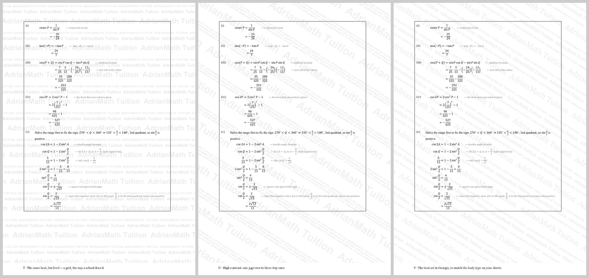

# Watermarks — the candidates Adrian liked (15 Sep 2026)

**A watermark goes on only when Adrian asks for it** — 16 Sep 2026: *"watermark only when i
request for it, otherwise no watermark"*. Nothing is on by default; `worksheet_lib.py` has no
`watermark=` argument. One book carries one today: the Sec 3 EM revision book, **T at 70 %**,
built by **[`book/bookify.py`](book/)**. This folder exists because Adrian looked at
twenty-two candidates on 15 Sep 2026 and said: *"i like T, U and V, put them into memory (not using
them yet, but may and iterate later)"* — and, later the same day, of the earlier pattern
batch: *"i like this watermark as well, which was G."* When he comes back to it, start from
these **four** rather than from a blank page.



## The three

All three are the same two words — **`AdrianMath Tuition`** — tiled at more than one point
size ("possible to have different size fonts forming the tessellation? just use adrianmath
tuition"). Each is a row pattern that repeats down the page; `designs.py` holds them.

| | what it is | why it might win |
|---|---|---|
| **T** `m-level.png` | 22 pt / 8 pt caps / 13 pt, **level** (angle 0) | Closest to RGS's own sheets — a level grid of the school's short name. Reads as a school's stationery rather than a security stamp. |
| **U** `m-contrast.png` | one 34 pt row answered by three 6.5 pt rows, −32° | The most designed of the three; the big row carries the name, the fine rows fill every gap a crop could land in. |
| **V** `m-serif.png` | the T/P beat set in **Georgia**, −32° | Matches the body type on his sheets, so it looks like part of the document rather than something laid over it. |

The four he passed over (P beat, Q pair, R scale, S sizes-along-the-line) are kept in
`designs.py` — the next iteration is far more likely to be a tweak of a shape already drawn.

## The fourth — G, which is not a carpet

**G** `p-icon-navy.png` — **one large AM badge**, brand navy `#1e3a5f`, **11%**: an 11 cm
rounded square outlined on the centre of the page, `AM` in Arial Bold across it and
`AdrianMath Tuition` in Georgia beneath. `patterns.py` `big_icon(pct=11, colour=NAVY)`.

It is the opposite trade to the carpets. The least busy of the twenty-two, so it is the one
that can sit under dense working without competing with it — and, being one mark in one
place, the easiest of the lot to crop off a photograph. Pick it for a page of solutions;
pick a carpet when the point is that a photograph of any corner carries the name.

The six patterns he passed over are kept beside it in `patterns.py`: honeycomb, isometric
ruling, the circles in grey and in navy, the tiled AM badge — and **E, this same badge in
grey at 9%**. E and G differ only in the ink, so it is the **navy at 11%** he picked, not
the shape alone.

## Running it

```
/usr/bin/python3 designs.py                     # writes m-*.png, 200 dpi A4 tiles (PIL lives here)
/usr/bin/python3 patterns.py                    # writes p-*.png — G first, then the six passed over
python3 stamp.py book.pdf m-level.png out.pdf 51   # put a tile UNDER page 51 of a real PDF (needs pypdf)
python3 mkdocx.py m-level.png out.docx          # the tile as a section-header picture
```

Judge a candidate over a **real page of maths**, never over a blank sheet — the only
question that matters is whether his working still reads through it.

## The two mechanisms

- **In a `.docx`**: a **PNG in the section header**, anchored `behindDoc="1"`, page-relative
  centre/centre, `wrapNone`, sized to the full 21.0 × 29.7 cm. Word's own Design → Watermark
  writes **VML WordArt, which LibreOffice draws as nothing** — proven; a picture is drawn by
  Word, LibreOffice, Preview, the printer and the photocopier alike. `mkdocx.py` is the
  working route end to end.
- **On an existing PDF**: flatten the RGBA tile onto white, save it as a one-page PDF at
  200 dpi, and `page.merge_page(stamp, over=False)` so the stamp draws FIRST and the page's
  own content sits on top. `stamp.py`.

## The four typographic rules that make it look set on purpose

Learned the hard way while building these; `mixsize.py` enforces all four.

1. **Rotate once, not per line.** Draw every row horizontally on an oversized square
   (`DIAG = hypot(A4) + 40`), rotate the whole thing once, then centre-crop to A4. Rotating
   each line separately is what makes a home-made watermark look home-made.
2. **Big sizes are set lighter.** The same grey does not read the same at 28 pt as at 7 pt.
   In T the 22 pt row is at 7% ink and the 8 pt caps at 13%, and on the page they read as the
   *same* weight.
3. **The gap after a word scales with its own point size** (`gap` is a multiple of the
   segment's size, not a fixed value) — otherwise the 28 pt words jam together while the
   7 pt ones float apart.
4. **The leading answers to BOTH adjacent rows** (`big = max(this row, next row)`), and
   mixed sizes in a row share a **baseline** (`anchor='ls'`), never a top edge.

Row phase: each row starts a third of its own repeat further along, so the seams never
stack into a visible vertical street.

## Putting one on a finished book — [`book/`](book/)

`book/bookify.py in.docx out.docx tile.png "EYEBROW" "TITLE|LINES" "subtitle"` does the whole
job on a `.docx` that already exists: the carpet into **every** section header (a section
without its own `headerReference` silently inherits, so all of them must be wired), a cover
page in its own section over an EMPTY header, and the figures made transparent so the carpet
runs through them. `book/cover.py` draws the cover. Adrian's file is never written over — the
rebuild goes beside it under a new name. **Judge the ink by pixel value, not by eye**: image
previews contrast-boost a faint tint, and 70 % is the practical floor for something printed.

## Two things that must be fixed before any of this ships

- **`savefig(..., transparent=True)` in the figure helpers.** Matplotlib saves an OPAQUE
  white background — `trig_figures/d_step1.png` is RGBA with corner alpha 255 — so every
  figure would punch a white rectangle through the carpet. The same one-word fix is also
  what lets the mark ride *inside* a figure that is cropped or photographed out of the sheet.
  (For a book that is already built, `book/bookify.py` fixes this after the fact — it took
  the white out of 104 of the EM book's 110 pictures.)
- **A carpet goes on what students KEEP, never on what comes back for marking.** The
  ScanSnap and the AI marker read a hand-in as an image, and grey under a student's working
  is noise where the marker is reading. Hand-in sheets, Practice Again and printed papers
  get the footer line only:
  `AdrianMath Tuition · prepared for Sim Ze Kai · 15 Sep 2026 · AM-7F3K` — 7.5 pt,
  `RGBColor(0x8A,0x8A,0x8A)`, centred. And per `docs/CONTENT-POLICY.md`, a sheet reproducing
  another school's or the GCE's questions gets the footer branded, not a carpet across
  someone else's question.

## What these four do NOT do

He chose "just use adrianmath tuition", so the carpet carries **no student name and no copy
serial** — it is branding, not traceability. Anything that needs to be traceable to one
student and one print run needs the footer line to do it. (The reference he sent was a
*sentence* — `… · CONFIDENTIAL · UNIQUE COPY · 46X53B` — where the carpet was the
traceability; `mixsize.py` can still set a sentence if he ever wants that back.)

And a PNG watermark is a deterrent, not a lock: anyone determined can strip it from a PDF.
What it buys is that a page photographed and forwarded still carries the name in the photo.

## Where the RGS look came from

`17953 - RGS_2021_Y4_MATHS2_PPA.pdf` p.2 is a scan (one 3508×2480 JPEG per page, no text
layer), so the LOOK was measured, not copied: `pdftoppm` at 200 dpi, A4 = 1654 × 2339 px →
a **level grid over the whole page including the margins**, ink ≈195–210 grey (**~20% black**),
**row pitch 90 px = 1.15 cm**, cap height ≈31 px ≈ **11 pt**, column pitch ≈1.5 cm.
